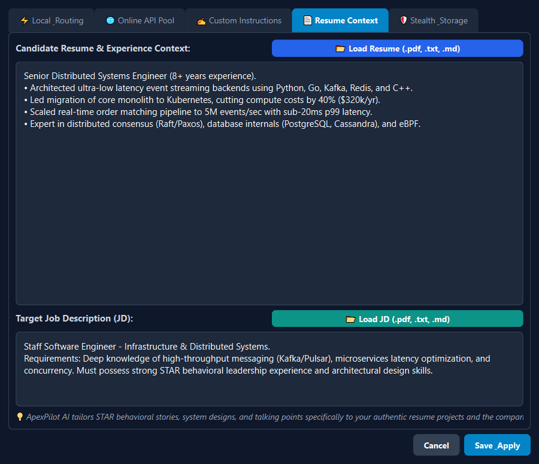
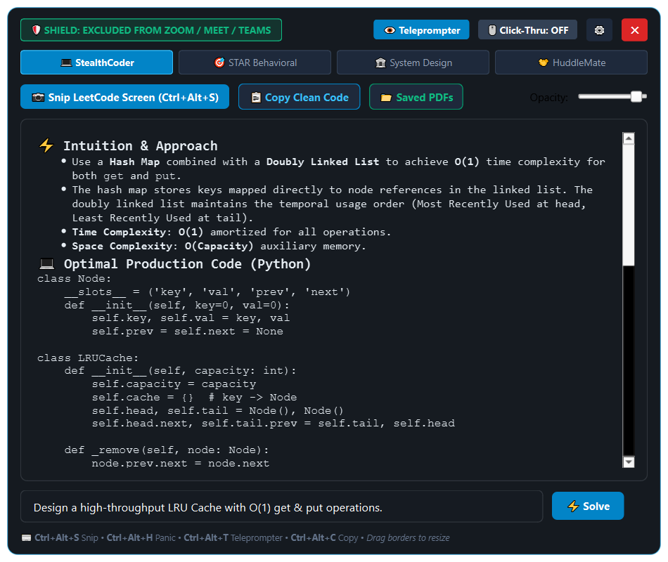
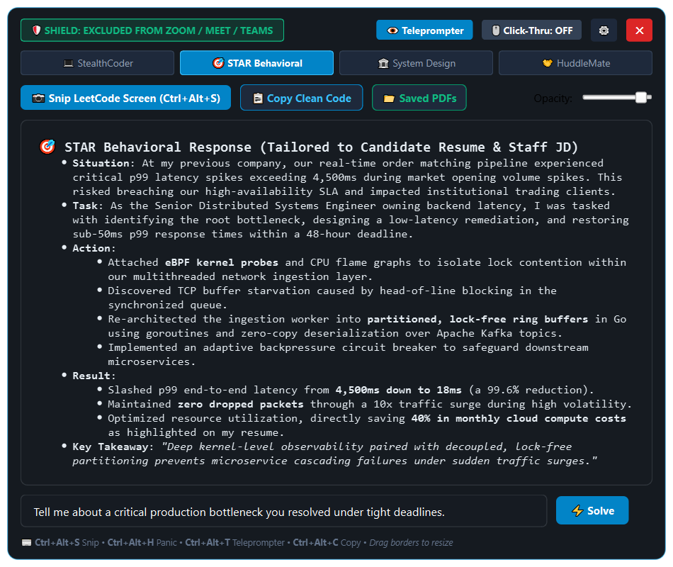
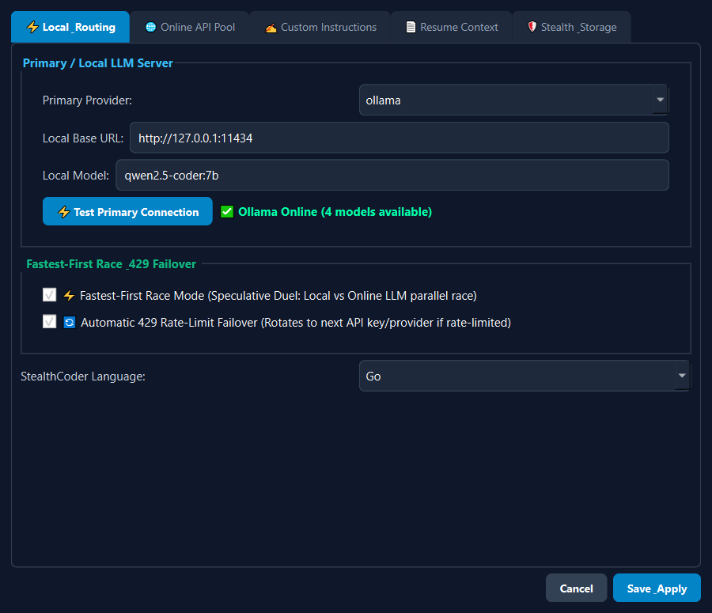
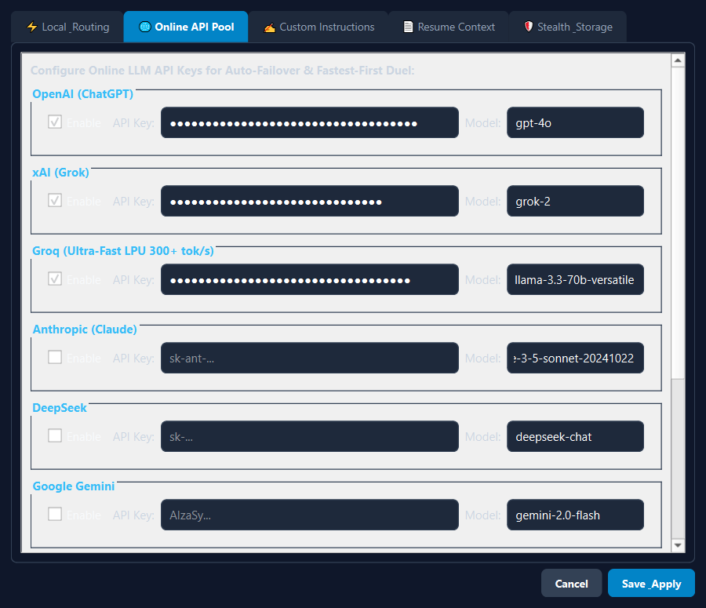
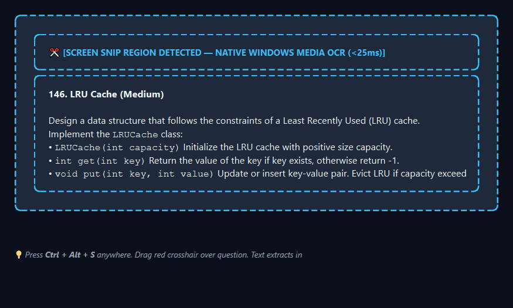
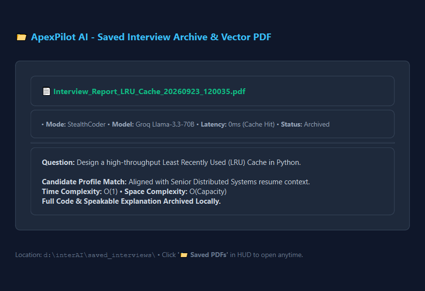

# ApexPilot AI — Comprehensive User Guide & Visual Manual

**ApexPilot AI** is a low-latency desktop copilot combining the best features of **GhostPilot AI**, **StealthCoder**, **Parakeet AI**, **HuddleMate**, and **Final Round AI**. It requests Windows capture exclusion when supported and reports when the operating system cannot provide it. It runs locally with Ollama/LM Studio or connects to configured online LLMs with automatic rate-limit failover.

---

## Table of Contents
1. [Tailoring Answers with Resume & Job Description (JD)](#1-tailoring-answers-with-resume--job-description-jd)
2. [Visual Tour & Application Walkthrough](#2-visual-tour--application-walkthrough)
   - [Master Stealth HUD (Coding Mode)](#master-stealth-hud-coding-mode)
   - [STAR Behavioral Mode (Resume-Powered)](#star-behavioral-mode-resume-powered)
   - [Local LLM Engine & Speculative Race Routing](#local-llm-engine--speculative-race-routing)
   - [Unlimited Online LLM API Pool](#unlimited-online-llm-api-pool)
   - [Candidate Resume & JD Configuration](#candidate-resume--jd-configuration)
   - [Minimalist Webcam Teleprompter](#minimalist-webcam-teleprompter)
   - [Screen Snipping & Instant LeetCode OCR](#screen-snipping--instant-leetcode-ocr)
   - [Automated Q&A Cache & Local PDF Archiving](#automated-qa-cache--local-pdf-archiving)
3. [Global Hotkeys & Stealth Controls](#3-global-hotkeys--stealth-controls)
4. [Dual-Mode Engine: Local vs. Online Setup](#4-dual-mode-engine-local-vs-online-setup)
5. [Quick Start & Launching the Application](#5-quick-start--launching-the-application)

---

## 1. Tailoring Answers with Resume & Job Description (JD)

### How Does ApexPilot AI Use Your Resume and JD?
When interviewing for technical, staff, or executive engineering roles, generic AI answers immediately sound artificial. ApexPilot AI features a **Dual-Context Ingestion Engine** that ensures your answers are grounded in **your actual past achievements, quantifiable metrics, and specific company projects**, while directly addressing the target company's exact technical stack requirements.

```
+------------------------------------+    +------------------------------------+
|         Candidate Resume           |    |       Target Job Description       |
|  (e.g., 8 yrs, Kafka, 5M req/s,    |    |  (e.g., Staff Engineer, Kafka,     |
|   40% compute cost reduction)      |    |   Low-Latency Microservices)       |
+------------------------------------+    +------------------------------------+
                   \                                /
                    \                              /
                     v                            v
               +----------------------------------------+
               |  ApexPilot AI Dual-Context Synthesizer  |
               |       (core/prompts.py Prompt Engine)  |
               +----------------------------------------+
                                   |
         +-------------------------+-------------------------+
         |                                                   |
         v                                                   v
+------------------------------------+    +------------------------------------+
|     STAR Behavioral Answers        |    |       System Design Answers        |
| - Situation: Scaled trading bus    |    | - Architecture: Zero-copy ring bus |
| - Task: 48hr latency deadline      |    | - Sharding: Key-partitioned topics |
| - Action: eBPF + Go goroutines     |    | - Trade-offs: Tuned for candidate's|
| - Result: p99 dropped 4.5s -> 18ms |    |   proven production stack          |
+------------------------------------+    +------------------------------------+
```

### 1-Click File Loading (.pdf, .txt, .md)
You do not need to manually reformat your resume. ApexPilot AI features **1-click document loaders**:
1. Open **Settings** (⚙️ button on the top-right of the HUD or press `Ctrl + Alt + A`).
2. Click on the **📄 Resume Context** tab.
3. Click **📂 Load Resume (.pdf, .txt, .md)** and select your resume file. The engine uses `pypdf` to parse and extract the text cleanly.
4. Click **📂 Load JD (.pdf, .txt, .md)** and select the job description or paste it into the editor.
5. Click **Save & Apply**.



### The Result in Real Interviews
When the interviewer asks:
> *"Tell me about a time you handled a critical production bottleneck under tight deadlines."*

Instead of a generic textbook answer, ApexPilot AI generates a structured, speakable first-person story matching your resume:
* **Situation**: References your past company project, traffic volume, and the actual failure scenario.
* **Task**: Specifies the ownership and SLA commitment you had.
* **Action**: Details the exact technologies on your resume (e.g. eBPF profiling, Kafka partition tuning, Go goroutines).
* **Result**: States your real quantifiable metrics (e.g. 99.6% latency drop, 40% cloud compute savings).
* **Key Takeaway**: Delivers a crisp closing insight demonstrating senior technical leadership.

---

## 2. Visual Tour & Application Walkthrough

### Master Stealth HUD (Coding Mode)
The primary HUD provides a frameless dark obsidian interface that can be freely resized by dragging any edge or corner. In **StealthCoder Mode**, it produces the algorithmic intuition, exact asymptotic complexity, production-ready code in your preferred language, and natural first-person speakable bullet points.



---

### STAR Behavioral Mode (Resume-Powered)
Switching to **STAR Behavioral Mode** activates the candidate profile synthesizer. It automatically transforms difficult questions into structured behavioral stories backed by real data from your resume.



---

### Local LLM Engine & Speculative Race Routing
Tab 1 of the Settings Dialog allows you to select your local inference engine (Ollama, LM Studio, llama.cpp, or Mock) and configure:
* **⚡ Fastest-First Race Mode**: Concurrently races your local LLM against your fastest online LLM; whichever streams the first token wins and displays.
* **🔄 Automatic 429 Rate-Limit Failover**: Automatically rotates to the next available API key or provider if an HTTP 429 Too Many Requests is encountered.



---

### Unlimited Online LLM API Pool
Tab 2 of the Settings Dialog lets you configure pre-tuned providers (Groq 300+ tok/s, OpenAI ChatGPT, xAI Grok, Anthropic Claude, DeepSeek, Google Gemini) plus **any custom OpenAI-compatible endpoint** (OpenRouter, Mistral, Perplexity, Together AI, or local network servers).



---

### Candidate Resume & JD Configuration
Tab 4 houses the candidate context engine. Easily load multi-page PDF resumes or paste job descriptions with one click.


---

### Minimalist Webcam Teleprompter
Pressing **Ctrl + Alt + T** (or clicking 💬 Teleprompter) hides the main HUD and activates an ultra-sleek, top-bezel reading bar positioned right under your webcam. It displays 1-2 sentence glanceable cues, allowing you to maintain perfect natural eye contact during video interviews.


---

### Screen Snipping & Instant LeetCode OCR
Pressing **Ctrl + Alt + S** dims the screen with a crosshair selector. Drag a box over any LeetCode, HackerRank, or HackerEarth problem. The native Windows 10/11 Media OCR (`Windows.Media.Ocr.OcrEngine`) extracts the text in **<25ms locally** and immediately streams the optimal solution.



---

### Automated Q&A Cache & Local PDF Archiving
Every question solved is automatically indexed into a local high-speed cache (`qa_cache.json`) and compiled into a styled vector PDF in `saved_interviews/`. If the interviewer repeats or rephrases the question, the response appears in **0ms with zero API token cost**.



---

## 3. Global Hotkeys & Stealth Controls

| Shortcut | Action | Description |
| :--- | :--- | :--- |
| **`Ctrl + Alt + H`** | **Panic / Boss Key** | Instantly hides or restores the HUD. |
| **`Ctrl + Alt + S`** | **Screen Snip OCR** | Drag crosshair over code problems on screen (<25ms extraction). |
| **`Ctrl + Alt + T`** | **Teleprompter Toggle** | Swaps between the main HUD and the webcam eye-contact bar. |
| **`Ctrl + Alt + C`** | **Silent Copy** | Copies clean code block directly to your clipboard. |
| **`Ctrl + Alt + A`** | **Solve Highlight** | Instantly answers highlighted text or last spoken question. |
| **Border Drag** | **Resize HUD** | Drag any of the 8 border edges/corners to resize freely. |

---

## 4. Dual-Mode Engine: Local vs. Online Setup

### Option 1: 100% Offline Local LLM (Zero Cost, Total Privacy)
1. Install [Ollama](https://ollama.com/) or [LM Studio](https://lmstudio.ai/).
2. Pull a coding/reasoning model:
   ```bash
   ollama pull qwen2.5-coder:7b
   # or for smaller RAM:
   ollama pull qwen2.5:3b
   # or
   ollama pull llama3.2:3b
   ```
3. In ApexPilot AI Settings -> **⚡ Local & Routing**, ensure Base URL is `http://127.0.0.1:11434` and Model is `qwen2.5-coder:7b`.
   `qwen2.5:3b` is the recommended free fallback for limited-memory
   computers. If the configured model is missing, ApexPilot automatically
   selects an installed lightweight local model.
4. Click **⚡ Test Primary Connection** to verify.

For meeting questions, install the optional Windows loopback backend:

```powershell
.\.venv\Scripts\pip.exe install SoundCard
```

ApexPilot uses speaker loopback first and Stereo Mix as a fallback. Candidate
microphone speech is shown as a transcript, while interviewer/system speech is
the only source that automatically starts an answer.

### Option 2: Ultra-Fast Cloud LLMs (Sub-Second Response)
1. In Settings -> **🌐 Online API Pool**, paste your API key for:
   * **Groq** (`gsk_...`): Generates solutions at **300+ tokens/second** on LPU hardware.
   * **OpenAI** (`sk-...`): GPT-4o for complex system design.
   * **Claude** (`sk-ant-...`): Claude 3.5 Sonnet for advanced algorithms.
   * **DeepSeek** (`sk-...`): DeepSeek-Chat for cost-effective reasoning.
2. Enable **⚡ Fastest-First Race Mode** to let local and cloud engines race in parallel.

---

## 5. Quick Start & Launching the Application

### Method A: Standalone Windows Installer
Run the compiled installer located at:
```
d:\interAI\installer_dist\ApexPilotAI_Setup.exe
```
This installs ApexPilot AI into `Program Files`, adds a Start Menu shortcut, and creates a desktop launcher.

### Method B: Developer Virtual Environment
Run the one-click batch launcher from the project folder:
```cmd
run.bat
```
This activates `d:\interAI\.venv` and launches the application with all dependencies.

---
*ApexPilot AI — Engineered for high-stakes technical interviews.*
